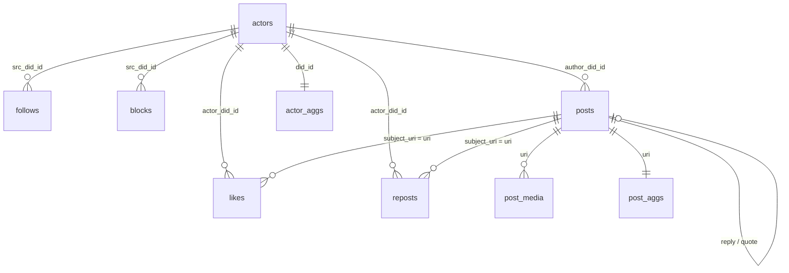

# ATProto Snapshotter

Produces a public DuckDB snapshot of the Bluesky social graph plus
post-relationship graph, derived end-to-end from the
[microcosm.blue constellation](https://tangled.org/microcosm.blue/microcosm-rs)
RocksDB backlinks index. Cheap, no-ceremony analytics on commodity hardware.

## Mental model

```
constellation rocksdb  --(eat-rocks)-->  local rocks mirror
local rocks mirror     --(stage)----->  staging parquet (per entity)
staging parquet        --(hydrate)--->  snapshot.duckdb
snapshot.duckdb        --(publish)--->  object store  [deferred]
```

Each stage is a single-responsibility module. The CLI exposes one
`build` command today; `--skip-{mirror,stage,hydrate}` lets you resume
mid-pipeline.

## CLI

```
at-snapshot build [flags]
```

| Flag | Default | Notes |
|---|---|---|
| `--config <path>` | — | TOML config file. CLI flags override its values. |
| `--work-dir <path>` | `./var` | Local working directory. |
| `--snapshot-date <YYYY-MM-DD>` | today UTC | Namespace for outputs. |
| `--memory-limit <size>` | `4GiB` | DuckDB memory cap. |
| `--batch-size <n>` | `100000` | Parquet writer batch size. |
| `--source-url <url>` | `https://constellation.t3.storage.dev` | eat-rocks source. |
| `--backup-id <u64>` | latest | Pin a specific constellation backup. |
| `--mirror-concurrency <n>` | `32` | eat-rocks fetch concurrency. Drop to 8 if you hit timeouts. |
| `--skip-mirror` | — | Reuse existing `./var/rocks/`. |
| `--skip-stage` | — | Reuse existing `./var/raw/<date>/*.parquet`. |
| `--skip-hydrate` | — | Stop after staging. |

## System dependencies

| Tool | Purpose | How it links |
|---|---|---|
| `libduckdb` 1.5.x | Hydrate stage uses the `duckdb` Rust crate, dynamically linked. | system shared library (`libduckdb.dylib`) |
| RocksDB | Stage stage opens the constellation mirror read-only via the `rocksdb` crate. | vendored (`librocksdb-sys` 0.16+8.10) |

### libduckdb (system, dynamic link)

Homebrew's `duckdb` formula ships only the CLI binary. Grab the official
release zip with the headers and shared library:

```sh
mkdir -p ~/.local/duckdb-1.5.2/lib ~/.local/duckdb-1.5.2/include
cd /tmp
curl -L -o libduckdb.zip https://github.com/duckdb/duckdb/releases/download/v1.5.2/libduckdb-osx-universal.zip
unzip -q libduckdb.zip
cp libduckdb.dylib ~/.local/duckdb-1.5.2/lib/
cp duckdb.h duckdb.hpp ~/.local/duckdb-1.5.2/include/
```

Then point Cargo at it via `.cargo/config.toml`:

```toml
[env]
DUCKDB_LIB_DIR     = "/Users/<you>/.local/duckdb-1.5.2/lib"
DUCKDB_INCLUDE_DIR = "/Users/<you>/.local/duckdb-1.5.2/include"
LIBCLANG_PATH      = "/Library/Developer/CommandLineTools/usr/lib"
```

When you run the resulting binary you may need
`DYLD_LIBRARY_PATH=$HOME/.local/duckdb-1.5.2/lib` so the loader can find
the dylib at runtime. No long C++ amalgamation compile.

### RocksDB (bundled)

The latest `librocksdb-sys` (0.17.x) targets rocksdb 10.4.2 while
Homebrew ships 11, whose C API is incompatible. We pin
`rocksdb = "0.22"` / `librocksdb-sys 0.16+8.10` and let it build from
source. Cargo caches the resulting library so it compiles **once**
(~2 min), then incremental builds are seconds. If you want to switch to
a system rocksdb, set `ROCKSDB_LIB_DIR` / `ROCKSDB_INCLUDE_DIR` and
bump the crate to a matching major.

Everything else is pure Rust.

## Output layout

```
var/
  rocks/                              # local rocksdb mirror (~80 GB)
  raw/<date>/
    actors.parquet
    follows.parquet
    blocks.parquet
    likes.parquet
    reposts.parquet
    posts_from_records.parquet
    posts_from_targets.parquet
    post_media.parquet
  snapshot/<date>/
    snapshot.duckdb
    snapshot_metadata.json
```

Query it with `duckdb var/snapshot/<date>/snapshot.duckdb`.

## Tables (ERD)



`source` on `posts` is `'record'` when we saw the post via constellation's
`link_targets` (so reply/quote refs are present) or `'target_only'` when we
only saw it as the target of someone else's like / reply / quote. Hydrate
prefers `record` rows when deduping by `uri`.

## Deferred (intentionally out of scope)

- Streaming / incremental updates (jetstream). Each snapshot is a full
  rebuild from a constellation backup.
- Post text, profile bios, display names, alt text. Constellation is a
  backlinks index; record bodies are not in scope until we add a separate
  ingest path.
- Media blob downloads / CDN mirroring.
- Language / labeler filters (will return when text is back in scope).
- Lists, feeds and feed generators, threadgates, starter packs.
- Publish to R2 / object store. The `publish` stage is wired into the
  module layout but not enabled — local artifacts only for now.

## Takedown requests

For takedowns please raise a GitHub issue and we will exclude the relevant
rows from future snapshots.
