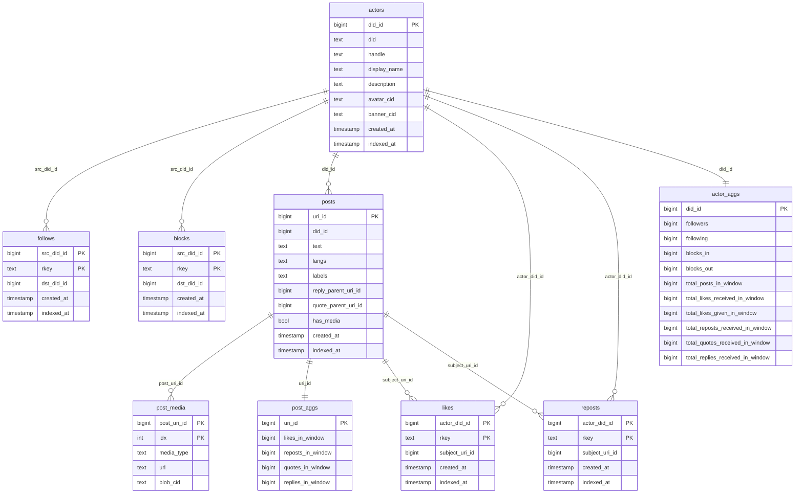

# at-snapshot

A four-stage pipeline that produces analytic snapshots of the Bluesky social
graph and post content for public consumption — lightweight enough to run on
commodity hardware, with R2 (or any S3-compatible store) as the system of
record.

## Mental model

The pipeline is three writers plus one observer:

```
   PLC + Constellation ─┐
                        ├─►  bootstrap   ──►  bootstrap/{date}/social_graph.duckdb
                        │                          (immutable baseline; written once)
        Jetstream ──────┼─►  run         ──►  raw/{date}/{collection}-*.parquet
                        │                          (append-only deltas)
                        ▼
                     snapshot ──►  snapshot/current_{all,graph}.duckdb
                                   snapshot/snapshot_metadata.json
                                          (rebuilt on each scheduled run)

                     monitor   ──►  /healthz, /status (HTTP)
```

- **bootstrap** is the seeding step. PLC tells us every DID; for each one we
  pull profile, follow, and block records from Constellation and write them
  to a DuckDB file at `bootstrap/{date}/social_graph.duckdb`. The spec says
  this file is *never overwritten*; it's the canonical baseline that all
  downstream snapshots build on.

- **run** is the long-lived stream consumer. It subscribes to one jetstream
  endpoint at a time (with failover across the configured list), decodes the
  records we care about, and writes them as parquet under
  `raw/YYYY-MM-DD/`. The cursor checkpoints to a local sqlite and mirrors to
  object storage so a fresh host can resume.

- **snapshot** is the rollup. It reads the past N days of `raw/` plus the
  bootstrap baseline and produces two DuckDB files:
  - `snapshot/current_graph.duckdb` — the **current state** social graph
    (bootstrap + every create/delete delta, *not* bounded by the window).
  - `snapshot/current_all.duckdb` — the same graph plus posts / likes /
    reposts / post_media / per-post and per-actor aggregates *bounded by the
    lookback window*. Window-scoped fields use the `_in_window` suffix so
    consumers don't confuse them with all-time totals.

- **monitor** is a read-only HTTP server that reports each pipeline's health
  by reading the local working directory and the object store. It never
  takes a writer lock.

## ERD



DIDs and post URIs are interned to `bigint` via xxhash64; the original
strings are kept alongside in `actors` and `posts` so collisions are
detectable at snapshot time.

## CLI

```
at-snapshot bootstrap    Build the immutable social_graph.duckdb baseline
at-snapshot run          Long-running jetstream consumer
at-snapshot snapshot     Materialize current_*.duckdb from the past N days
at-snapshot monitor      HTTP server reporting job status
```

Run `at-snapshot <command> -h` for the full flag set. Common flags:

| flag | env | default | meaning |
|---|---|---|---|
| `-data-dir` | `AT_SNAPSHOT_DATA_DIR` | `./data` | Local working dir (sqlite cursor, staging duckdb, logs) |
| `-object-store` | `AT_SNAPSHOT_OBJECT_STORE` | `local` | Backend: `local`, `s3`, `memory` |
| `-object-store-root` | `AT_SNAPSHOT_OBJECT_STORE_ROOT` | `./data/object-store` | Bucket name (s3) or root dir (local) |
| `-lookback-days` | `AT_SNAPSHOT_LOOKBACK_DAYS` | `30` | Snapshot window |
| `-duckdb-memory-limit` | `AT_SNAPSHOT_DUCKDB_MEMORY_LIMIT` | `2GB` | DuckDB working memory cap |
| `-languages` | `AT_SNAPSHOT_LANGUAGES` | `en` | Comma-separated language allow-list for posts (empty = no filter) |
| `-labelers` | `AT_SNAPSHOT_LABELERS` | `did:plc:ar7c4by46qjdydhdevvrndac` | Labeler DIDs to honor |
| `-include-labels` | `AT_SNAPSHOT_INCLUDE_LABELS` | (none) | Labels that must be present on a post |
| `-exclude-labels` | `AT_SNAPSHOT_EXCLUDE_LABELS` | (none) | Labels that drop a post |
| `-jetstream-endpoints` | `AT_SNAPSHOT_JETSTREAM_ENDPOINTS` | (4 official endpoints) | Failover list for `run` |
| `-addr` | `AT_SNAPSHOT_MONITOR_ADDR` | `:8080` | Listen address for `monitor` |
| `-concurrency` | `AT_SNAPSHOT_CONCURRENCY` | `16` | Parallel workers in fan-out fetches |
| `-stats-interval` | `AT_SNAPSHOT_STATS_INTERVAL` | `30s` | Periodic stats emission interval |

Filters apply only to record types that carry the relevant metadata —
language and label filters touch posts and not engagement records, since
likes/follows/reposts/blocks don't carry those fields.

S3 access keys are read from `AT_SNAPSHOT_S3_ACCESS_KEY_ID` and
`AT_SNAPSHOT_S3_SECRET_ACCESS_KEY` to keep them off the process arg list.

## Operational notes

- **Idempotency**: every command can be re-run safely. Bootstrap tracks
  per-DID progress in the staging duckdb and skips completed DIDs on
  restart. Run advances its cursor only after a successful flush, so a crash
  loses at most one flush interval (default 30s) of events. Snapshot is a
  pure rollup with deterministic output for a given input.

- **Crash recovery**: any half-written parquet still in the run staging
  directory gets re-uploaded under `raw/recovered/` on the next start, where
  the snapshot wildcard glob picks them up.

- **Takedowns**: open a GitHub issue against this repo.

## Excluded record types

For now the snapshot does not include lists, feeds, feed generators, or
threadgates. Only text content is stored — no media beyond URLs and blob
CIDs.
