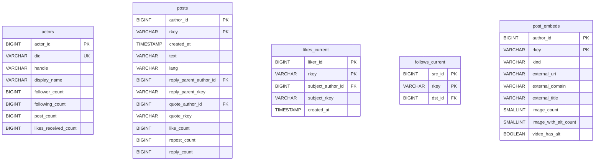

# atproto-db-snapshot

```warning
This is all AI generated in a couple short sessions -- it will be refined over time. 
```

A snapshotter for ATProto that produces queryable DuckDB files and a
parquet event archive. Full design in [`specs/001_bootstrap.md`](specs/001_bootstrap.md).

## How to run

One Go binary, three subcommands.

```bash
# Build from source
go build -o at-snapshotter ./cmd/at-snapshotter
```

### `run` — Jetstream consumer (long-running)

Streams events from Bluesky's Jetstream into a local SQLite staging DB.
At UTC midnight it seals yesterday's events into per-day parquet shards
and (optionally) uploads them to the object store.

```bash
./at-snapshotter run -data-dir ./data
```

Restart-safe: cursor is persisted atomically in `./data/cursor.json`.
Compressed frames (`compress=true`) are on by default — decoded with
Bluesky's published zstd dictionary, embedded in the binary.

### `build` — produce the queryable DuckDB snapshots

```bash
# First-time graph seed: PLC enumeration + per-PDS listRecords backfill
# (spec 003). Defaults: 8 workers/host, 9 req/sec/host, ~50 hosts → ~50× more
# parallelism than the legacy single-relay path. Set -limit 0 for the full
# network, or e.g. -limit 10000 for a quick smoke test.
./at-snapshotter build -mode graph-backfill -limit 10000 -data-dir ./data

# Tunables: -plc-rps, -plc-refresh-days, -pds-workers-per-host,
# -pds-rps-per-host, -pds-timeout, and -use-constellation (optional
# follower/likes-received enrichment via constellation.microcosm.blue).

# Nightly: replay yesterday's parquet shards into current_all.duckdb
./at-snapshotter build -mode incremental -data-dir ./data -file-store ./store

# Force full rebuild + emit a graph bootstrap archive
./at-snapshotter build -mode force-rebuild -data-dir ./data -file-store ./store
```

Output: `./data/current_graph.duckdb` (actors + edges) and, after
incremental builds, `./data/current_all.duckdb` (adds posts, likes,
reposts). `-file-store DIR` points at a local directory that doubles as
an S3-compatible store for testing; production swaps it for R2 via
`config.yaml` (see `specs/001_bootstrap.md` §11 for the full shape).

### `serve` — health dashboard

```bash
./at-snapshotter serve -data-dir ./data -listen 127.0.0.1:8080
```

Read-only. `GET /` renders an HTML dashboard; `/api/summary` returns the
same data as JSON; `/metrics` emits Prometheus format.

### Querying the snapshot

```sql
-- DuckDB CLI, remote URL, or in-process driver
ATTACH 'https://your-bucket.r2.dev/current_all-v1.duckdb' AS s (READ_ONLY);

-- Proportion of posts that got exactly 1 like (in the crawled sample)
SELECT
  COUNT(*) AS total_posts,
  SUM(CASE WHEN like_count = 1 THEN 1 ELSE 0 END) AS with_one_like,
  100.0 * SUM(CASE WHEN like_count = 1 THEN 1 ELSE 0 END) / COUNT(*) AS pct
FROM s.posts;

-- Top authors by followers
SELECT handle, follower_count
FROM s.actors
ORDER BY follower_count DESC
LIMIT 10;
```

See `queries.sql` for more examples.

## ERD — `current_all.duckdb`

High-level relationships. Column detail below.

```mermaid
---
config:
  layout: elk
---
erDiagram
    actors          ||--o{ posts           :
    actors          ||--o{ likes_current   :
    actors          ||--o{ reposts_current :
    actors          ||--o{ follows_current : 
    actors          ||--o{ blocks_current  : 
    posts           ||--o{ likes_current   : 
    posts           ||--o{ reposts_current : 
    posts           ||--o{ posts           :
    posts           ||--o| post_embeds     :
```

Entity detail:



`reposts_current` mirrors `likes_current` (`reposter_id` in place of
`liker_id`); `blocks_current` mirrors `follows_current`. Columns omitted
from the diagram above for brevity: `actors.{description, avatar_cid,
created_at, indexed_at, likes_given_count, reposts_received_count,
blocks_given_count}`, `posts.{cid, reply_root_author_id, reply_root_rkey,
embed_type}`.

The `post_embeds` sidecar (spec [`002`](specs/002_post_embeds.md)) carries
one row per post with an embed — keyed `(author_id, rkey)` so it joins
directly to `posts`. Use it for external-link analytics (`external_domain`
is pre-computed) or image-accessibility studies (`image_with_alt_count`).
Posts without an embed have no row.

Key design points:

- **ID interning.** DIDs are interned to sequential `BIGINT actor_id`s
  (spec §4). The sidecar table `actors_registry(actor_id, did, first_seen)`
  inside `current_all.duckdb` holds the mapping.
- **Structural URIs.** Post URIs are stored as `(author_id, rkey)` pairs,
  not strings — reconstruct as `at://{actors.did}/app.bsky.feed.post/{rkey}`.
  The same pattern applies to `subject_*`, `reply_*`, and `quote_*`
  columns.
- **Soft self-references.** `posts.reply_parent_*`, `reply_root_*`, and
  `quote_*` may point at posts that predate retention or have been
  deleted — always use `LEFT JOIN`.
- **Graph subset.** `current_graph.duckdb` is the same `actors` table
  plus `follows_current`, `blocks_current`, and `_meta` — no posts,
  likes, or reposts. Use it when you only need the social graph.

## Takedowns

If you believe content in a published snapshot should be removed (CSAM, DMCA,
court order, harassment material, etc.), submit a report containing the
offending `at://` URI(s) and a reason to: `<add contact>`.

Reports are processed by adding entries to a `takedowns.yaml` file consumed
by the next nightly build:

```yaml
takedowns:
  - uri: at://did:plc:xxx/app.bsky.feed.post/3abc
    reason: CSAM report 2026-03-14
    date: 2026-03-14
  - uri: at://did:plc:yyy/app.bsky.actor.profile/self
    reason: DMCA
    date: 2026-03-20
```

Posts have their content fields nullified (the row is preserved so reply /
quote references stay valid); profiles have their mutable fields nullified;
likes, reposts, follows, and blocks are deleted. The audit table
`takedowns_applied` inside `current_all.duckdb` records every URI processed
so repeated runs are idempotent.

**Lag.** Prior published parquet files are *not* retroactively edited —
takedowns take effect at the next nightly build of `current_all.duckdb` and
`current_graph.duckdb`. To force a takedown-only build immediately:

```
./at-snapshotter build -mode incremental -takedowns ./takedowns.yaml
```

### Labeler subscription

Bluesky's own moderation team publishes takedown decisions as labels on
the `com.atproto.label.subscribeLabels` stream at
`wss://mod.bsky.app`. The `labels` subcommand subscribes to that stream
and persists every label into `<data-dir>/labels.db` so the nightly
`build` can auto-apply the moderation team's `!takedown` and `!hide`
decisions without operator intervention:

```bash
./at-snapshotter labels -data-dir ./data &
```

Restart-safe: cursor is persisted atomically at
`<data-dir>/labels_cursor.json`. Reconnects with exponential backoff
(5s → 60s max).

When paired with the nightly `build`, the incremental path reads
`labels.db`, selects every URI currently labeled `!takedown` or `!hide`
by `did:plc:ar7c4by46qjdydhdevvrndac` (Bluesky's moderation DID), and
funnels them through the same application as `takedowns.yaml` — posts
nullified, profiles redacted, likes/reposts/follows/blocks deleted. The
two sources merge and de-duplicate; audit rows in `takedowns_applied`
carry a `bsky-labeler:<val>@<cts>` reason so operator-curated YAML
entries are distinguishable from labeler entries.

To opt out of the labeler source (only operator YAML will be applied):

```bash
./at-snapshotter build -skip-labeler-takedowns ...
```

**Retractions.** Labels emitted with `neg=true` (label removals) are
*not* honored to un-redact previously redacted content — they are
suppressed only at query time (no URI is returned from the takedown
set). Restoring previously-nullified rows requires a rebuild from
parquet archives.
