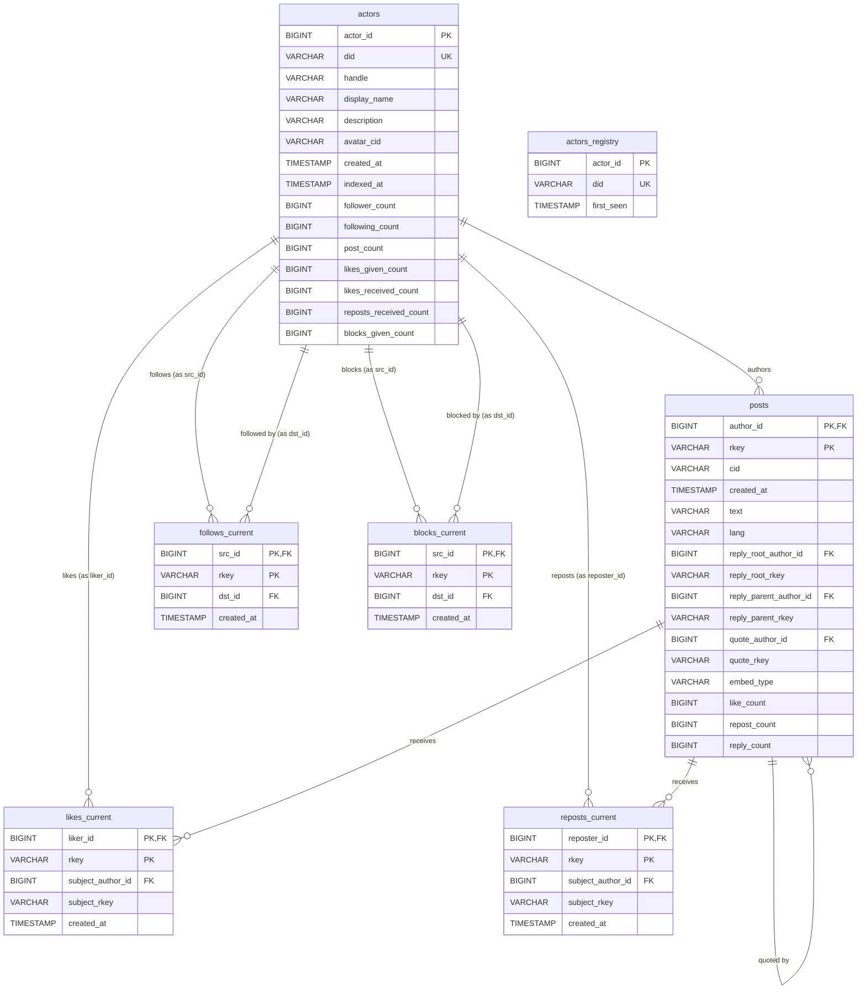

# Bluesky Public Data Snapshot → DuckDB + Parquet → Object Store

Plan for a standalone Go service that periodically snapshots all **public**
Bluesky data into two self-contained DuckDB files plus a daily-partitioned
parquet event log. Primary object-store target is Cloudflare R2, behind a
portable `ObjectStore` interface.

Design priorities (locked in):

1. **Option A — full likes materialized.** Individual `(liker, subject, time)`
   rows are kept in the current snapshot, not just aggregates.
2. **ID interning.** DIDs and post URIs are interned to compact integer keys
   to make Option A tractable on commodity hardware.
3. **Dead-simple CLI:** one binary `at-snapshotter` with three
   subcommands: `build`, `run`, and `serve` (health dashboard).
4. **Commodity hardware first.** Target: 16 GB RAM, 500 GB SSD. Storage
   headroom is the binding constraint; retention window and content filters
   are the calibration knobs.
5. **Build-time filters.** Parquet archive stays full-fidelity; snapshot
   assembly applies user-configured filters (e.g., language allowlist).

---

## 1. Goal and scope

### What we capture

| Record type | AT Proto collection | `current_graph.duckdb` | `current_all.duckdb` | Daily parquet |
|---|---|:-:|:-:|:-:|
| Profiles | `app.bsky.actor.profile` | ✅ (`actors`) | ✅ | ✅ (`profile_updates`) |
| Posts | `app.bsky.feed.post` | — | ✅ | ✅ |
| Likes | `app.bsky.feed.like` | — | ✅ (Option A) | ✅ |
| Reposts | `app.bsky.feed.repost` | — | ✅ | ✅ |
| Follows | `app.bsky.graph.follow` | ✅ | ✅ | ✅ |
| Blocks | `app.bsky.graph.block` | ✅ | ✅ | ✅ |
| Handle ↔ DID | PLC directory | ✅ (`actors.handle`) | ✅ | ✅ (profile_updates) |
| Deletions | any `#delete` op | applied | applied | ✅ (`deletions`) |

### Non-goals (explicitly excluded)

- **Media blobs** (avatars, post images, video).
- **Lists, list items, list blocks.**
- **Starter packs.**
- **Threadgates, postgates.**
- **Feed generators.**
- **Labels / labeler services** — deferred; can add later additively.
- **Private data** (mutes, DMs, app passwords, OAuth sessions).

---

## 2. CLI surface

The entire tool is three subcommands. All read the same `config.yaml`.

### `at-snapshotter run`

Long-running process. Consumes Bluesky's Jetstream
(<https://docs.bsky.app/blog/jetstream>) — JSON-over-WebSocket with
server-side collection filtering and microsecond cursor resumption.
Buckets events by UTC day, writes parquet shards, uploads sealed days
to the object store. Persists cursor so restarts resume cleanly.

```
at-snapshotter run [--config ./config.yaml]
```

Never exits on its own. Safe to `SIGTERM`; cursor is fsync'd on each shard
flush.

### `at-snapshotter build`

One-shot. Produces `current_graph.duckdb` and `current_all.duckdb` for
today's UTC date. Resolution order for its starting point:

1. **Local snapshot present** (`./data/current_all.duckdb`) → use as base,
   replay any parquet days newer than its `_meta.built_at`.
2. **Local missing, object store has recent snapshot** → download, use as
   base, replay.
3. **Neither** → full backfill via `com.atproto.sync.listRepos` +
   `getRepo`. This is the 24–72h first run.

Flags:
- `--force-rebuild` — skip the resolution order, always do a full CAR crawl.
- `--no-upload` — build locally, skip publishing.
- `--date YYYY-MM-DD` — build for a specific UTC date (default: today).
- `--bootstrap` — also emit a graph bootstrap (§7) for this build.
  Automatic after any `--force-rebuild`; otherwise only runs when this
  flag is set.
- `--retain N` — keep the most recent `N` days of `./data/daily/*`
  locally; delete older directories at the end of the build. Defaults to
  `7`. Object-store retention is separate (`retention.parquet_days`,
  default 90) — `build` never deletes from the object store based on
  `--retain`.

```
at-snapshotter build [--config ./config.yaml] [--force-rebuild] [--no-upload] [--bootstrap] [--retain N]
```

Exits 0 on success with snapshot published and `latest.json` updated.

### `at-snapshotter serve`

Long-running HTTP server that exposes a health dashboard over the
running system. Read-only; reads logs, `latest.json`, the cursor file,
local parquet staging, and opens `current_graph.duckdb` in
`READ_ONLY` mode. Never interferes with `run` or `build`. Full design
in §10.

```
at-snapshotter serve [--config ./config.yaml] [--listen 127.0.0.1:8080]
```

Renders a single HTML dashboard at `/`, a JSON API at `/api/*`, and a
Prometheus-format metrics endpoint at `/metrics`. Defaults to binding
loopback — point a reverse proxy at it if you want remote access.

### Typical operation

```
# Day 0: start Jetstream consumer and dashboard, leave both running
at-snapshotter run   &
at-snapshotter serve &

# Day 1 and onward: nightly cron
0 1 * * *  at-snapshotter build
```

---

## 3. Architecture

```
 ┌───────────────────┐
 │  at-snapshotter run     │  Jetstream → per-UTC-day parquet shards
 │  (long-running)   │  upload sealed days to object store
 └─────────┬─────────┘
           │  daily/YYYY-MM-DD/*.parquet
           ▼
 ┌───────────────────────────────────────────┐
 │  Object store (R2 default)                │
 │    daily/YYYY-MM-DD/       (events)  │
 │    bootstrap/YYYY-MM-DD/   (state)   │
 │    current_graph-v1.duckdb                │
 │    current_all-v1.duckdb                  │
 │    registry/actors.parquet                │
 │    latest.json                            │
 └───────────────────────────────────────────┘
           ▲
           │  nightly
 ┌─────────┴─────────┐
 │  at-snapshotter build   │  base snapshot + new parquet days
 │  (one-shot)       │  → apply filters → Option A duckdb
 └───────────────────┘
```

Four artifact classes, each queryable standalone:

1. **`current_graph-v1.duckdb`** — actors + edge graph. Overwritten nightly.
2. **`current_all-v1.duckdb`** — full materialized state incl. posts and
   individual likes (Option A). Overwritten nightly.
3. **Daily parquet archive** (`daily/…`) — append-only **event log**,
   hive-partitioned. Retention configurable (default 90 days).
4. **Graph bootstrap archive** (`bootstrap/…`) — **state snapshots** of
   profiles + follows + blocks. Emitted at every full rebuild and
   on-demand via `--bootstrap`. Retained forever. See §7.

A fifth artifact is needed to decode interned IDs:

5. **`registry/actors.parquet`** — the `did → actor_id` map. Small (~300 MB
   at 35M DIDs). Published with each build; strictly additive.

Both DuckDB files are **fully self-contained**: they carry the registry
tables inline, so consumers never need to download `actors.parquet`
separately unless they want to decode the parquet archive.

### 3.1 `latest.json` — the coordination pointer

Single source of truth for "what's currently published." Uploaded LAST
by `build`, so anything that references it is guaranteed consistent.
Served with `Cache-Control: max-age=60` so consumers don't thrash.

```json
{
  "schema_version": "v1",
  "built_at":       "2026-04-26T04:18:00Z",
  "build_mode":     "incremental",            // "backfill" | "incremental"
  "build_duration_seconds": 1082,

  "current_graph": {
    "url":       "https://pub-xxx.r2.dev/current_graph-v1.duckdb",
    "size_bytes": 21457829632,
    "sha256":    "e3b0c44298fc1c149afbf4c8996fb92427ae41e4649b934ca495991b7852b855"
  },
  "current_all": {
    "url":       "https://pub-xxx.r2.dev/current_all-v1.duckdb",
    "size_bytes": 98374921216,
    "sha256":    "a1b2c3…"
  },
  "registry": {
    "url":       "https://pub-xxx.r2.dev/registry/actors.parquet",
    "size_bytes": 314572800,
    "row_count":  35102443
  },

  "archive_base":     "https://pub-xxx.r2.dev/daily/",
  "bootstrap_base":   "https://pub-xxx.r2.dev/bootstrap/",
  "latest_bootstrap_date": "2026-04-01",      // null if none yet
  "oldest_daily_date":     "2026-01-27",      // set by retention
  "newest_daily_date":     "2026-04-25",

  "jetstream_cursor": 1714095582123456,       // cursor as of build start
  "jetstream_endpoint": "wss://jetstream2.us-east.bsky.network/subscribe",

  "row_counts": {
    "actors":           35102443,
    "posts":          1412998552,
    "likes_current":  29884211007,
    "reposts_current": 482771211,
    "follows_current":  976543812,
    "blocks_current":    8421012
  },

  "filter_config": {
    "posts": { "langs": ["en"], "exclude_no_lang": false },
    "exclude_collections": []
  }
}
```

Fields consumers MUST tolerate being missing (forward-compat): anything
not in the v1 minimum set `{schema_version, built_at, current_graph.url,
current_all.url, archive_base}`. Everything else is additive.

---

## 4. ID interning strategy

This is the lever that makes Option A fit on commodity hardware. Applies
only to the DuckDB snapshots — the parquet archive stores raw DIDs and
URIs so it remains self-describing.

### DIDs → `actor_id` (sequential INT64)

Stable, sequential integer IDs assigned on first sight. Stored in a
local registry (`./data/registry.db`, SQLite) for fast lookup, mirrored
to `registry/actors.parquet` on publish.

**Why INT64 (not INT32)?** 35M DIDs fits INT32 today, but we pay only 4
extra bytes per row to never think about it again — and sorted INT64s
still compress tightly (DuckDB RLE + bit-packing is width-adaptive). No
upgrade path, no overflow scare, matches Go's natural `int64`, aligns
cleanly for cache and on-disk layouts.

Sequential > hash for two reasons:
- **Compression.** Sorted sequential integers compress at 10–100× under
  DuckDB's RLE + bit-packing. Random 64-bit hashes don't.
- **No collision handling.** 64-bit hash collisions on 35M items are rare
  but not zero (~3×10⁻⁵), and resolving them after publish is a mess.

Registry schema:

```sql
CREATE TABLE actors_registry (
  actor_id   BIGINT PRIMARY KEY,   -- monotonic, assigned on first sight
  did        VARCHAR UNIQUE NOT NULL,
  first_seen TIMESTAMP
);
```

Once assigned, an `actor_id` is never reused and never changes. Deleted
accounts keep their ID (but profile fields may be null).

### Post URIs → structural `(author_id, rkey)` pair

URIs are not interned to a registry — they're stored structurally:
`(author_id INT32, rkey VARCHAR)`. A post's full URI is reconstructible as
`at://{did}/app.bsky.feed.post/{rkey}` via a join on `actors_registry`.

Why not a URI registry? ~15B post URIs over years × ~60 bytes ≈ 900 GB of
registry alone. Structural encoding is 8 bytes (`author_id`) + ~13 bytes
(`rkey`, dict-encoded in DuckDB to ~2–3 bytes effective) with zero
registry cost.

The same treatment applies to any URI-valued column (`reply_root_uri`,
`quote_uri`, `subject_uri`): split into `*_author_id` + `*_rkey`.
Collection is implicit by column meaning and column name.

### rkeys

Kept as `VARCHAR` (TID-sortable, 13 chars). DuckDB's dict encoding handles
repetition across rows. TID-to-int64 decoding is tempting (13 chars → 8
bytes) but fragile for collections that may use non-TID rkeys.

### Languages, CIDs, embed types

No explicit interning. DuckDB dict encoding + zstd handles them natively.

---

## 5. DuckDB schemas

All size annotations are **uncompressed row width**; DuckDB's columnar
compression typically reduces by 3–10×.

### `current_graph.duckdb`

```sql
CREATE TABLE actors (
  actor_id                 BIGINT PRIMARY KEY,
  did                      VARCHAR NOT NULL UNIQUE,
  handle                   VARCHAR,
  display_name             VARCHAR,
  description              VARCHAR,
  avatar_cid               VARCHAR,
  created_at               TIMESTAMP,
  indexed_at               TIMESTAMP,
  follower_count           BIGINT,
  following_count          BIGINT,
  post_count               BIGINT,
  likes_given_count        BIGINT,
  likes_received_count     BIGINT,
  reposts_received_count   BIGINT,
  blocks_given_count       BIGINT
);
CREATE INDEX actors_handle ON actors(handle);
CREATE INDEX actors_did    ON actors(did);

CREATE TABLE follows_current (
  src_id     BIGINT NOT NULL,       -- → actors.actor_id
  dst_id     BIGINT NOT NULL,
  rkey       VARCHAR NOT NULL,       -- compose URI as at://{src.did}/app.bsky.graph.follow/{rkey}
  created_at TIMESTAMP,
  PRIMARY KEY (src_id, rkey)
);
CREATE INDEX follows_dst ON follows_current(dst_id);

CREATE TABLE blocks_current (
  src_id     BIGINT NOT NULL,
  dst_id     BIGINT NOT NULL,
  rkey       VARCHAR NOT NULL,
  created_at TIMESTAMP,
  PRIMARY KEY (src_id, rkey)
);
CREATE INDEX blocks_dst ON blocks_current(dst_id);

CREATE TABLE _meta (
  schema_version   VARCHAR,
  built_at         TIMESTAMP,
  jetstream_cursor BIGINT,          -- microseconds since UNIX epoch
  build_mode       VARCHAR,          -- 'backfill' | 'incremental'
  filter_config    VARCHAR           -- JSON blob of filters applied
);
```

### `current_all.duckdb`

Everything above, plus:

```sql
CREATE TABLE posts (
  author_id         BIGINT NOT NULL,       -- → actors.actor_id
  rkey              VARCHAR NOT NULL,
  cid               VARCHAR,
  created_at        TIMESTAMP,
  text              VARCHAR,
  lang              VARCHAR,
  reply_root_author_id   BIGINT,
  reply_root_rkey        VARCHAR,
  reply_parent_author_id BIGINT,
  reply_parent_rkey      VARCHAR,
  quote_author_id   BIGINT,
  quote_rkey        VARCHAR,
  embed_type        VARCHAR,                -- 'images'|'video'|'external'|'record'|null
  like_count        BIGINT,                 -- denormalized
  repost_count      BIGINT,                 -- denormalized
  reply_count       BIGINT,
  PRIMARY KEY (author_id, rkey)
);
CREATE INDEX posts_reply_root  ON posts(reply_root_author_id, reply_root_rkey);
CREATE INDEX posts_created_at  ON posts(created_at);

CREATE TABLE likes_current (
  liker_id              BIGINT NOT NULL,
  rkey                  VARCHAR NOT NULL,
  subject_author_id     BIGINT NOT NULL,
  subject_rkey          VARCHAR NOT NULL,
  created_at            TIMESTAMP,
  PRIMARY KEY (liker_id, rkey)
);
CREATE INDEX likes_subject ON likes_current(subject_author_id, subject_rkey);

CREATE TABLE reposts_current (
  reposter_id           BIGINT NOT NULL,
  rkey                  VARCHAR NOT NULL,
  subject_author_id     BIGINT NOT NULL,
  subject_rkey          VARCHAR NOT NULL,
  created_at            TIMESTAMP,
  PRIMARY KEY (reposter_id, rkey)
);
CREATE INDEX reposts_subject ON reposts_current(subject_author_id, subject_rkey);

```

### Entity relationships (ERD)



Notes on the diagram:
- `actors_registry` is a sidecar (SQLite locally, `registry/actors.parquet`
  when published). It carries the `did ↔ actor_id` map. In the DuckDB
  files, its contents are inlined into `actors.did` + `actors.actor_id`,
  so consumers don't need it unless decoding raw parquet archives.
- Self-referential edges on `posts` (reply_parent, reply_root, quote) are
  soft — the referenced post may predate retention or have been deleted;
  joins should be LEFT JOINs.
- `current_graph.duckdb` contains only `actors`, `follows_current`,
  `blocks_current`, and `_meta`. The rest are `current_all.duckdb` only.

### Per-row size comparison (Option A, likes_current)

| Encoding | liker | rkey | subject | time | Row raw | 4.5B rows raw |
|---|---|---|---|---|---|---|
| Original VARCHAR URIs | 60 B | — | 60 B | 8 B | 128 B | ~576 GB |
| DID-only interned (INT64) | 8 B | 13 B | 60 B | 8 B | 89 B | ~401 GB |
| Full structural (INT64) | 8 B | 13 B | 21 B | 8 B | 50 B | ~225 GB |

Compressed (zstd + RLE + bit-packing on sorted IDs) typically 4–6×
smaller than raw → **~40–60 GB** for 4.5B likes. Fits 500 GB SSD
comfortably after filters.

---

## 6. Parquet archive schema

The archive stores **raw DIDs and URIs** — no interning. Rationale:
self-describing (no registry dependency), already dict-compressed inside
each parquet file, trivial to reprocess into a future schema version.

Each `daily/YYYY-MM-DD/` directory:

Every parquet row carries a `date DATE` column — identical for all rows
in a file, RLE-compressed to effectively zero bytes. Consumers filter
with `WHERE date BETWEEN …` over a glob; no hive partitioning needed.

```
posts.parquet
  date              DATE          -- same for all rows; enables glob + filter
  event_type        VARCHAR       -- 'create' | 'update'
  uri               VARCHAR       -- at://did/app.bsky.feed.post/rkey
  did               VARCHAR
  rkey              VARCHAR
  cid               VARCHAR
  event_ts          TIMESTAMP     -- Jetstream time_us (authoritative)
  record_ts         TIMESTAMP     -- record.createdAt (client-reported; may lie)
  text              VARCHAR
  lang              VARCHAR
  reply_root_uri    VARCHAR
  reply_parent_uri  VARCHAR
  quote_uri         VARCHAR
  embed_type        VARCHAR

likes.parquet        date, uri, liker_did, subject_uri, subject_cid, event_ts, record_ts
reposts.parquet      date, uri, reposter_did, subject_uri, subject_cid, event_ts, record_ts
follows.parquet      date, uri, src_did, dst_did, event_ts, record_ts
blocks.parquet       date, uri, src_did, dst_did, event_ts, record_ts
profile_updates.parquet  date, did, handle, display_name, description, avatar_cid, event_ts
deletions.parquet    date, collection, uri, did, event_ts
```

**Compression:** zstd level 6.
**Path layout:** flat `daily/YYYY-MM-DD/<collection>.parquet` — no
`key=value` partition prefix. Pruning and listing are trivial directory
ops.
**Row groups:** 128 MB target, sorted within each group by `did` (posts,
profile_updates) or `liker_did`/`src_did` (edges) for scan efficiency.

### Per-day `_manifest.json`

```json
{
  "date": "2026-04-24",
  "schema_version": "v1",
  "jetstream_cursor_start": 1714009182123456,
  "jetstream_cursor_end":   1714095581987654,
  "built_at": "2026-04-25T00:15:00Z",
  "row_counts": { "posts": ..., "likes": ..., ... },
  "bytes": { "posts.parquet": ..., ... }
}
```

---

## 7. Graph bootstrap archive

The daily parquet archive is an **event log** (creates / updates /
deletes). To reconstruct graph state at any historical date from the log
alone you'd need every event since Bluesky's genesis — impossible given
retention. The bootstrap solves this: a periodic **state snapshot** of
profiles and follows, against which later daily events can be replayed
forward to any point in time.

### Layout

```
object-store://bucket/
  bootstrap/
    2026-04-24/
      profiles.parquet          # snapshot of all actor profiles
      follows.parquet           # snapshot of all active follows
      blocks.parquet            # snapshot of all active blocks
      _manifest.json            # jetstream_cursor at snapshot time, row counts
    2026-05-01/
      ...
```

A consumer reconstructing "the follow graph on 2026-06-15" does:

```sql
-- Start from the most recent bootstrap ≤ target date
CREATE TABLE follows AS
  SELECT * FROM read_parquet(
    'https://pub-<hash>.r2.dev/bootstrap/2026-06-01/follows.parquet');

-- Replay daily events up to the target
WITH events AS (
  SELECT * FROM read_parquet(
    'https://pub-<hash>.r2.dev/daily/*/follows.parquet')
  WHERE date BETWEEN '2026-06-02' AND '2026-06-15'
)
INSERT INTO follows
  SELECT uri, src_did, dst_did, record_ts AS created_at
  FROM events WHERE event_type = 'create';

DELETE FROM follows WHERE uri IN (
  SELECT uri FROM read_parquet(
    'https://pub-<hash>.r2.dev/daily/*/deletions.parquet')
  WHERE collection = 'app.bsky.graph.follow'
    AND date BETWEEN '2026-06-02' AND '2026-06-15'
);
```

### Schema (raw, self-describing — matches parquet archive philosophy)

```
profiles.parquet
  did              VARCHAR        -- raw; not interned
  handle           VARCHAR
  display_name     VARCHAR
  description      VARCHAR
  avatar_cid       VARCHAR
  created_at       TIMESTAMP
  indexed_at       TIMESTAMP
  snapshot_ts      TIMESTAMP      -- when this bootstrap was frozen (same for all rows)

follows.parquet
  uri              VARCHAR        -- at://src_did/app.bsky.graph.follow/rkey
  src_did          VARCHAR
  dst_did          VARCHAR
  created_at       TIMESTAMP
  snapshot_ts      TIMESTAMP

blocks.parquet
  uri              VARCHAR
  src_did          VARCHAR
  dst_did          VARCHAR
  created_at       TIMESTAMP
  snapshot_ts      TIMESTAMP
```

Raw DIDs (not `actor_id`): the bootstrap must be decodable without the
registry, same as the daily archive.

### Per-bootstrap `_manifest.json`

```json
{
  "date": "2026-04-24",
  "schema_version": "v1",
  "snapshot_ts": "2026-04-24T00:00:00Z",
  "jetstream_cursor": 1714095581987654,
  "row_counts": {
    "profiles": 35102443,
    "follows": 492118734,
    "blocks": 8421012
  },
  "prior_bootstrap": "2026-03-24"
}
```

`jetstream_cursor` is the single most important field: it's the exact
microsecond replay point for a consumer (or `run`) walking events
forward from this bootstrap.

### When bootstraps are emitted

1. **First run / rebuild.** At the end of `at-snapshotter build --force-rebuild`
   (or a true cold start with no prior artifact), the tool writes a
   bootstrap — this is the canonical starting state and the cursor at
   which `run` began subscribing.
2. **On demand.** `at-snapshotter build --bootstrap` forces emission on any
   invocation.

No scheduled cadence. If you want periodic bootstraps, cron
`at-snapshotter build --bootstrap` at whatever interval you want; the tool
itself stays simple.

### Sizing & retention

| Artifact | Approx size (zstd) |
|---|---|
| `profiles.parquet` | ~2–3 GB (35M rows) |
| `follows.parquet` | ~6–10 GB (~500M rows) |
| `blocks.parquet` | ~100–200 MB |
| **Per bootstrap** | **~8–13 GB** |

Retention: **keep all bootstraps forever in the object store**
(append-only, never deleted) — they're the only way to reconstruct
history beyond the daily archive's 90-day window. Local disk stores
none; they're written and immediately uploaded.

At 12/year × ~10 GB ≈ 120 GB/year. After 10 years, still ~1.2 TB in
cold object storage — trivial cost.

### Bootstrap and `at-snapshotter build` interaction

Bootstrap emission is a **pure read** from the just-built
`current_graph.duckdb` (which is materialized graph state in DuckDB
form). Writing the three parquet files is a fast `COPY (SELECT …) TO …
(FORMAT PARQUET, COMPRESSION zstd)`. No extra crawl, no extra memory,
typical extra runtime ~2–5 min.

This also means: **the bootstrap inherits any filters applied at build
time.** A profiles bootstrap built with `filters.posts.langs=[en]` still
contains all actors (actors aren't language-filtered) but joins to posts
would be filtered downstream. Document this; it's easy to misread.

---

## 8. `at-snapshotter run` — Jetstream consumer

Event source is **Jetstream** — Bluesky's JSON-over-WebSocket firehose.
Spec & rationale: <https://docs.bsky.app/blog/jetstream>. Jetstream
decodes the binary repo firehose (`com.atproto.sync.subscribeRepos`)
into line-oriented JSON records, filters server-side by collection,
and exposes cursor resumption via microsecond timestamps. This is
strictly easier to consume than the CBOR firehose and removes
runtime CAR parsing from the hot path.

### Connection

```
wss://jetstream2.us-east.bsky.network/subscribe
  ?wantedCollections=app.bsky.actor.profile
  &wantedCollections=app.bsky.feed.post
  &wantedCollections=app.bsky.feed.like
  &wantedCollections=app.bsky.feed.repost
  &wantedCollections=app.bsky.graph.follow
  &wantedCollections=app.bsky.graph.block
  &cursor=<microseconds-since-epoch>         # optional, resume point
  &compress=true                             # zstd-compressed frames
```

Config exposes `jetstream.endpoints: []` as an ordered failover list.
Defaults to `jetstream2.us-east`, `jetstream1.us-east`,
`jetstream2.us-west`, `jetstream1.us-west`. Rotate on connection drop.

### Message shape (Jetstream `commit` event)

```json
{
  "did": "did:plc:abc123",
  "time_us": 1714095582123456,
  "kind": "commit",
  "commit": {
    "rev": "3kfzd…",
    "operation": "create" | "update" | "delete",
    "collection": "app.bsky.feed.post",
    "rkey": "3kf…",
    "cid": "bafy…",
    "record": { /* only on create|update */ }
  }
}
```

`time_us` is the cursor — microseconds since UNIX epoch, monotonic
within a single Jetstream endpoint. Store the largest `time_us` seen
so far; resume with `?cursor=<that value minus a small rewind>`.

### Pipeline

1. Connect + resume from cursor file (see §8.1).
2. For each commit event, decode the `record` per `collection` into a
   typed Go struct (indigo lexicon types) and push onto an in-memory
   buffer keyed by `(utc_day, collection)`.
3. **No rolling `.part` files.** Each collection's buffer is backed by
   a local append-only SQLite table `staging_events_<collection>` in
   `./data/staging.db`. One `INSERT` per event; WAL mode; checkpoint
   every 10k rows or 60s. This replaces the earlier "reopen parquet
   `.part`" design — parquet-go row groups aren't safely reopenable
   across processes, and SQLite is trivially crash-safe.
4. At **UTC midnight + 10-min grace**: for yesterday's
   `(day, collection)` pairs:
   - `COPY (SELECT * FROM staging_events_<coll>
           WHERE day = yesterday ORDER BY did, rkey)
      TO './data/daily/YYYY-MM-DD/<coll>.parquet'
      (FORMAT PARQUET, COMPRESSION zstd, COMPRESSION_LEVEL 6)`
   - compute `_manifest.json`
   - upload via `ObjectStore`
   - `DELETE FROM staging_events_<coll> WHERE day = yesterday`
5. fsync cursor to `./data/cursor.json` after every SQLite checkpoint
   (≥ once/minute in steady state, once per event is unnecessary).
6. On restart: reopen `staging.db`, resume Jetstream from the persisted
   cursor (minus a few seconds of rewind to cover any in-flight events
   not yet checkpointed). Duplicate events on the overlap are dedup'd
   by composite PK `(did, collection, rkey, operation, time_us)` on
   insert via `INSERT OR IGNORE`.

`run` performs **no filtering** and **no interning**. It is a dumb,
durable write-down of Jetstream.

### 8.1 Cursor file format

`./data/cursor.json`:

```json
{
  "cursor": 1714095582123456,
  "endpoint": "wss://jetstream2.us-east.bsky.network/subscribe",
  "updated_at": "2026-04-26T00:14:37.208Z",
  "schema_version": "v1"
}
```

- `cursor` is the largest `time_us` successfully committed to
  `staging.db`. Monotonic within one endpoint.
- Written via `write-to-tempfile + os.Rename` for atomicity. Never
  updated in place.
- On endpoint switch (failover), rewind the cursor by 10 seconds to
  tolerate clock skew between Jetstream instances.

### Graceful degradation

- **Jetstream lag alarm.** Emit metric when `now - cursor > 5 min`.
- **Disk pressure.** When free disk < 10 GB, stop accepting new events
  (close WebSocket; log loudly). `run` never deletes the daily archive;
  retention cleanup is `build`'s job.
- **Staging.db bloat.** Warn if `staging.db` grows past 3 GB — this
  means a sealed day failed to upload; investigate before next midnight
  or you'll accumulate.

---

## 9. `at-snapshotter build` — snapshot assembly

### Resolution order

```
if --force-rebuild:
    go to Full Backfill
elif ./data/current_all.duckdb exists:
    base = local
elif object_store.exists("current_all-v1.duckdb"):
    download → base
else:
    Full Backfill

replay all daily/*/*.parquet where date > base._meta.built_at
apply filters
write current_all.duckdb + current_graph.duckdb atomically
upload via object store

if --bootstrap OR just did full backfill:
    emit bootstrap/YYYY-MM-DD/{profiles,follows,blocks}.parquet
    upload bootstrap manifest

update latest.json
prune ./data/daily/* older than --retain days   (local disk)
prune daily/* older than retention.parquet_days (object store)
```

### Full backfill (first run or `--force-rebuild`)

Roughly the Mode 1 of the original plan, with interning:

1. `com.atproto.sync.listRepos` against `bsky.network`, paginated. ~35M DIDs.
   Persist to `./data/did_queue` (roaring bitmap + SQLite) for resumability.
2. Download PLC directory export for `did:plc` → current handle mapping.
   Resolve `did:web` from their DID document.
3. 100–200 parallel workers against `com.atproto.sync.getRepo?did=<did>`.
   Global `golang.org/x/time/rate` token bucket. Respect `Retry-After`.
4. Parse CARs via `indigo/repo` → per-collection typed channels.
5. Assign `actor_id`s via the registry **at DID-resolution time**, not
   during insert — keeps hot path branchless.
6. Bulk-insert via DuckDB Appender API into a working copy of
   `current_all.duckdb`. One appender per table per worker. Flush every
   50k rows.
7. Apply filters (language allowlist, etc.) as a SQL `DELETE` pass after
   ingest — cheaper than checking per-row in the hot path.
8. Compute denormalized counts in a single SQL pass:
   ```sql
   UPDATE actors SET follower_count = (
     SELECT count(*) FROM follows_current WHERE dst_id = actors.actor_id
   );
   -- similarly for following_count, post_count, like counts on posts, etc.
   ```
9. `CHECKPOINT`. `COPY` graph subset → `current_graph.duckdb`. Upload both.
10. Record starting `jetstream_cursor` in `_meta` (captured at step 1
    so `run` picks up from the right point).
11. **Emit initial bootstrap.** `COPY (SELECT did, handle, …) TO
    'bootstrap/YYYY-MM-DD/profiles.parquet'`; same for follows and
    blocks. Upload. This is the canonical replay anchor.

### Incremental build (normal nightly)

1. Open base `current_all.duckdb` read-write.
2. For each parquet day newer than base, in chronological order:
   - Intern any new DIDs via registry (bulk `INSERT OR IGNORE` into
     `actors_registry`, then join to assign IDs).
   - Apply deletions first (removes any rows the subsequent creates might
     re-insert).
   - Apply creates/updates per collection via SQL INSERT ... SELECT with
     filter predicates in the WHERE clause.
   - Update denormalized counts incrementally: `UPDATE posts SET
     like_count = like_count + Δ WHERE ...` from aggregates over the
     day's likes.
3. Recompute `actors.*_count` for affected actors only (set-based, not
   full table).
4. `CHECKPOINT`. `COPY` graph subset → `current_graph.duckdb`. Upload.
5. If `--bootstrap` was passed, emit and upload `bootstrap/YYYY-MM-DD/`.
6. Prune `./data/daily/*` directories older than `--retain` (default 7)
   from the local disk.
7. Prune `daily/*` directories older than `retention.parquet_days` from
   the object store. Bootstraps are never pruned.

### Atomic publish

Upload `current_all-v1.duckdb.new` → verify hash → server-side rename to
`current_all-v1.duckdb`. Consumers hitting the URL mid-upload get the
prior complete file, never a torn one.

Update `latest.json` last, after both DuckDB files are renamed.

---

## 10. Dashboard server (`at-snapshotter serve`)

A small HTTP server that answers "is the indexer healthy?" at a glance.
Read-only, no auth by default, loopback-bound. Safe to leave running
indefinitely alongside `run` and `build`.

### Data sources

| Source | Kind | Purpose |
|---|---|---|
| `./data/cursor.json` | file | current Jetstream cursor (µs since epoch) |
| `./data/latest.json` | file | last published build: timestamps, URLs, row counts |
| `./data/logs/run.log`, `./data/logs/build.log` | slog JSONL | tail for recent errors + events/sec over last N lines |
| `./data/parquet-staging/*` | filesystem | in-flight shard sizes, # events today |
| `./data/daily/*` | filesystem | sealed-but-not-pruned days and their sizes |
| `./data/current_graph.duckdb` | DuckDB READ_ONLY | row counts, `_meta`, registry size |
| Object store (optional) | HEAD/LIST | sealed archive presence, bootstrap inventory |
| `df ./data` | syscall | disk headroom |

All reads are opportunistic: if a source is missing or locked, the
server renders `—` for that card and keeps going. `serve` never blocks
`run` or `build`.

### Dashboard cards (rendered at `/`)

```
┌─ Firehose ────────────────────────────┐  ┌─ Last build ─────────────────────────┐
│ cursor      123 987 654               │  │ built_at    2026-04-26 04:18 UTC     │
│ lag         00:01:14 (behind now)     │  │ mode        incremental              │
│ events/sec  8 421  (1-min rolling)    │  │ duration    17 min                   │
│ by kind     posts 22%  likes 58%  …   │  │ actors      35 102 443               │
│ last flush  3 s ago   (ok ✓)          │  │ posts       1 412 998 552 (+8.1M d/d)│
└───────────────────────────────────────┘  │ likes       29 884 211 007 (+132M)   │
                                           │ schema      v1                       │
┌─ Today's shard ───────────────────────┐  └──────────────────────────────────────┘
│ date        2026-04-26                │
│ size        1.84 GB                   │  ┌─ Disk ───────────────────────────────┐
│ events      14 820 118                │  │ free         231 GB / 500 GB         │
│ est. seal   00:10 UTC (in 19h 22m)    │  │ ./data used  214 GB                  │
└───────────────────────────────────────┘  │ largest      current_all.duckdb 98 GB│
                                           │ headroom ok  ✓                       │
┌─ Local retention (--retain 7) ────────┐  └──────────────────────────────────────┘
│ days on disk  7  (2026-04-20 … 26)    │
│ total         12.8 GB                 │  ┌─ Object store ───────────────────────┐
│ oldest drops  2026-04-27 build        │  │ daily/ count    90                   │
└───────────────────────────────────────┘  │ bootstrap/ count 3                   │
                                           │ latest bootstrap 2026-04-26          │
┌─ Errors (last 200 log lines) ─────────┐  │ latest.json age  14 min              │
│ 0 ERROR                               │  └──────────────────────────────────────┘
│ 2 WARN                                │
│ → 2026-04-25 14:22  getRepo 429 (did… │
│ → 2026-04-25 09:11  cursor rewind 42  │
└───────────────────────────────────────┘
```

Auto-refreshes every 5 s via a small `fetch('/api/summary')` poll; no
websockets, no JS framework.

### HTTP surface

| Path | Content | Notes |
|---|---|---|
| `GET /` | HTML dashboard | hand-written template, no framework |
| `GET /api/summary` | JSON, everything above | ~5 KB; used by the dashboard poll |
| `GET /api/jetstream` | JSON | cursor, lag, events/sec, per-collection split |
| `GET /api/build` | JSON | passthrough of `latest.json` + local `_meta` if different |
| `GET /api/disk` | JSON | `df` + per-subdir sizes |
| `GET /api/retention` | JSON | local days present, total bytes, which one drops next |
| `GET /api/errors?since=10m` | JSON | counted/sampled log records |
| `GET /metrics` | Prometheus text | for scraping |

### Prometheus metrics (subset)

```
at_snapshotter_jetstream_cursor_us            gauge   (µs since epoch)
at_snapshotter_jetstream_lag_seconds          gauge
at_snapshotter_jetstream_events_total{kind=…} counter
at_snapshotter_build_last_success_timestamp   gauge
at_snapshotter_build_duration_seconds         gauge
at_snapshotter_build_rows{table=…}            gauge
at_snapshotter_disk_free_bytes{mount=…}       gauge
at_snapshotter_retention_local_days           gauge
at_snapshotter_errors_total{level=…}          counter
```

### Implementation notes

- Stateless: no database of its own. Each request re-reads the files.
- Event-rate computation: tail the last ~20k log lines, bin by timestamp,
  divide. Cheap; no need for a ring buffer unless the log volume is huge.
- DuckDB reads use `ATTACH … (READ_ONLY)` so `build` can hold the
  write-lock without blocking `serve`.
- Template rendered with `html/template`, CSS inline, zero JS
  dependencies besides the refresh poll. Total page < 50 KB.
- Config:
  ```yaml
  serve:
    listen: 127.0.0.1:8080
    refresh_seconds: 5
    log_tail_lines: 20000
  ```

### What it explicitly does NOT do

- No writes, no mutations, no buttons that trigger builds.
- No historical time-series storage. Prometheus scrapes the `/metrics`
  endpoint if you want retention; `serve` itself remembers nothing.
- No authn/authz. Loopback-bind and front with a reverse proxy if you
  expose it remotely.

---

## 11. Filter configuration

`config.yaml`:

```yaml
object_store:
  type: r2                     # r2 | s3 | gcs | file
  bucket: my-bsky-snapshot
  endpoint: https://<acct>.r2.cloudflarestorage.com
  public_url_base: https://pub-<hash>.r2.dev
  # credentials from env: OS_ACCESS_KEY, OS_SECRET_KEY

relay:
  host: bsky.network
  listrepos_workers: 150
  rate_limit_rps: 80

jetstream:
  endpoints:
    - wss://jetstream2.us-east.bsky.network/subscribe
    - wss://jetstream1.us-east.bsky.network/subscribe
    - wss://jetstream2.us-west.bsky.network/subscribe
    - wss://jetstream1.us-west.bsky.network/subscribe
  compress: true                 # zstd-compressed frames
  rewind_seconds: 10             # cursor rewind on reconnect / failover

retention:
  parquet_days: 90             # keep 90d of event log locally and in object store

filters:
  posts:
    langs: [en]                # keep only posts with lang in this set; null/unset = keep all
    exclude_no_lang: false
  # Optionally drop entire collections from current_all (still in parquet archive):
  exclude_collections: []      # e.g., ['app.bsky.feed.repost']

paths:
  data_dir: ./data             # local working dir: staging parquet, duckdb, registry
  temp_dir: ./data/tmp         # DuckDB spill dir for external sorts

duckdb:
  memory_limit: 12GB           # leave headroom for OS + Go
  threads: 4
```

Filters are **build-time**. The parquet archive is always full fidelity,
so changing filters and rebuilding is a local-only operation (no
re-crawl).

---

## 12. Object store abstraction

```go
type ObjectStore interface {
    Exists(ctx context.Context, key string) (bool, error)
    Get(ctx context.Context, key string, w io.Writer) error
    PutAtomic(ctx context.Context, key string, r io.Reader, size int64) error
    List(ctx context.Context, prefix string) ([]ObjectInfo, error)
    Delete(ctx context.Context, key string) error
    PublicURL(key string) string
}
```

Implementations:
- `internal/store/r2.go` — AWS SDK v2 S3 client with R2 endpoint.
- `internal/store/s3.go` — plain S3 deferred; implement when needed.
- `internal/store/file.go` — local filesystem (for testing + offline).
- `internal/store/gcs.go` — deferred; implement when needed.

`PutAtomic` uses `.new` + server-side copy + delete semantics on S3/R2; on
`file://` it's `write-to-tmp + rename`.

---

## 13. Hardware & storage sizing

Target: **16 GB RAM, 500 GB SSD.**

### Steady-state disk budget (with `retention.parquet_days=90`)

| Artifact | Local | Notes |
|---|---|---|
| `./data/current_all.duckdb` | ~60–100 GB | After Option A + interning + English filter. Pre-filter: ~150–250 GB. |
| `./data/current_all.duckdb.new` | same | Transient during build; deleted on success. |
| `./data/current_graph.duckdb` | ~15–30 GB | Subset of current_all. |
| `./data/daily/*` | ~2 GB/day × 7 ≈ 14 GB | Retained local copies per `--retain` (default 7). |
| `./data/parquet-staging` | ~2 GB | Only the day currently being written by `run`. |
| `./data/registry.db` | ~1.5 GB | SQLite, DID → actor_id. |
| `./data/did_queue` | <100 MB | Bitmap during backfill only. |
| DuckDB temp (spills) | up to 50 GB | External sort during CHECKPOINT. |
| **Peak during build** | **~300 GB** | Base + .new + temp + staging. |

Object store footprint (not counted against local SSD):
- 90 days of daily parquet (~2 GB/day raw × 0.4 zstd) ≈ **~72 GB**
- Bootstraps: ~10 GB each, cumulative forever. Rate depends on how often
  you run `--force-rebuild` or `--bootstrap`. A once-per-quarter cadence
  ≈ **~40 GB/year**.
- Two DuckDB snapshot files: **~75–130 GB** (overwritten, not cumulative)

Full backfill CAR staging is intentionally streaming — never landed to
disk. Bootstrap emission is also streamed directly to the object store
(no local copy); its cost to local disk is a brief temp file during
`COPY`, reclaimed on completion.

### RAM budget

- DuckDB: 12 GB (`memory_limit=12GB`).
- Go runtime + channels + Jetstream buffers: ~1–2 GB.
- OS + slack: ~2 GB.

For `run` specifically, RAM usage is flat and small (~500 MB) — it's a
write-through pipeline. RAM pressure is entirely a `build`-phase concern.

### Calibration knobs if you outgrow 500 GB

In order of preference:
1. Drop `retention.parquet_days` (90 → 60 → 30).
2. Narrow `filters.posts.langs`.
3. `exclude_collections: ['app.bsky.feed.repost']` — reposts are a
   surprising fraction of row count.
4. As a last resort, fall back to Option B aggregates (change
   `likes_current` to `posts.like_count` only).

---

## 14. Build details that matter

- **Sort before CHECKPOINT.** For every table > 10M rows, sort by the
  highest-selectivity filter column before final write. Sorted integer
  columns (post-interning) compress 10–100× under RLE + bit-packing;
  unsorted they're close to raw.
  - `follows_current` → sort by `(src_id, rkey)`
  - `blocks_current` → sort by `(src_id, rkey)`
  - `likes_current` → sort by `(subject_author_id, subject_rkey)` — the
    primary access pattern is "who liked post X"
  - `reposts_current` → sort by `(subject_author_id, subject_rkey)`
  - `posts` → sort by `(author_id, rkey)` (matches PK order, free)
- **Build indexes last.** Bulk-insert first, `CREATE INDEX` second,
  `CHECKPOINT` third.
- **Use the Appender API** via `go-duckdb`. 10–50× faster than prepared
  statements for bulk insert. Note: the Appender has no `ON CONFLICT`
  support — see the upsert pattern below for anything that isn't a
  pure bulk-insert-into-empty-table.

### 14.1 Upsert pattern (incremental build)

Incremental `build` replays the day's parquet events into an existing
snapshot. Creates may collide with existing rows (genuine updates or
duplicate restart-overlap events). Deletes may reference rows that
don't exist (retention cutoff, earlier filter). The pattern below
handles both idempotently.

**Step 1 — stage.** For each collection, stage the day's events via
the Appender into a TEMP table with no PK:

```sql
CREATE TEMP TABLE stage_likes AS SELECT * FROM likes_current LIMIT 0;
-- Appender bulk-inserts parquet rows into stage_likes …
```

**Step 2 — apply deletes first.** Deletes of non-existent rows are a
silent no-op (left join / anti-join style):

```sql
DELETE FROM likes_current
 WHERE (liker_id, rkey) IN (
   SELECT liker_id, rkey FROM stage_deletes_likes
 );
```

**Step 3 — upsert creates/updates.** DuckDB supports
`INSERT … ON CONFLICT DO UPDATE` against tables with a defined PRIMARY
KEY (0.9+). For each table:

```sql
INSERT INTO likes_current
  SELECT liker_id, rkey, subject_author_id, subject_rkey, created_at
  FROM stage_likes
ON CONFLICT (liker_id, rkey) DO UPDATE SET
  subject_author_id = EXCLUDED.subject_author_id,
  subject_rkey      = EXCLUDED.subject_rkey,
  created_at        = EXCLUDED.created_at;
```

For tables where updates are genuinely disallowed (e.g., follows are
create-or-delete, never mutated), swap to `DO NOTHING`. Duplicate
restart-overlap events then collapse harmlessly.

**Step 4 — drop stage, repeat** for each collection. All of this
runs in a single DuckDB transaction per day so the snapshot is
never torn.

### 14.2 Counts: full recompute, not Δ

For `actors.{follower_count, following_count, post_count,
likes_given_count, likes_received_count, reposts_received_count,
blocks_given_count}` and `posts.{like_count, repost_count,
reply_count}`:

- **Incremental `+Δ` is wrong** — the day's events are a superset of
  real changes (restart overlap, late arrivals), and filters mean
  some creates don't land but their like_counts still should.
- **Full recompute, scoped to the set of touched actors/posts** is
  cheap, set-based, and always correct:

```sql
WITH touched AS (
  SELECT DISTINCT author_id AS actor_id FROM stage_posts
  UNION SELECT DISTINCT liker_id FROM stage_likes
  UNION SELECT DISTINCT src_id  FROM stage_follows
  UNION SELECT DISTINCT dst_id  FROM stage_follows
  -- ...etc
)
UPDATE actors SET
  follower_count  = (SELECT count(*) FROM follows_current
                     WHERE dst_id = actors.actor_id),
  following_count = (SELECT count(*) FROM follows_current
                     WHERE src_id = actors.actor_id),
  post_count      = (SELECT count(*) FROM posts
                     WHERE author_id = actors.actor_id)
  -- ...
WHERE actor_id IN (SELECT actor_id FROM touched);
```

Full backfill does the unscoped version (`WHERE TRUE`).
- **Set `memory_limit` explicitly.** Otherwise DuckDB will happily use
  all 16 GB and OOM with the Jetstream consumer running alongside.
- **Set `temp_directory` explicitly.** DuckDB spills external sorts
  there; default `/tmp` may be on a small root partition.
- **Atomic publish.** `.new` upload → verify → rename.
- **Final CHECKPOINT** before upload so WAL is flushed. Document that
  consumers should `ATTACH ... (READ_ONLY)` if re-attaching.

---

## 15. Go stack

- **Jetstream client** (live path): standard library
  `nhooyr.io/websocket` (or `gorilla/websocket`) + `encoding/json`.
  Jetstream is JSON-over-WebSocket with optional zstd frame
  compression — no AT-Proto-specific library required for the live
  path. See <https://docs.bsky.app/blog/jetstream>.
- **AT Proto** (backfill path only): `github.com/bluesky-social/indigo`
  - `repo` — CAR + MST parsing (for `getRepo` during full backfill)
  - `api/bsky` — lexicon types (shared across live + backfill)
  - `atproto/identity` — DID resolution
  - `atproto/syntax`
- **DuckDB**: `github.com/marcboeker/go-duckdb` — Appender API for bulk
  loads.
- **Parquet**: `github.com/parquet-go/parquet-go` (cleaner ergonomics).
  Pick one; don't mix with Arrow.
- **Object store**: AWS SDK v2 S3
  (`github.com/aws/aws-sdk-go-v2/service/s3`) with custom endpoint for R2.
- **SQLite registry**: `modernc.org/sqlite` (pure-Go, no cgo headache
  alongside go-duckdb which already uses cgo).
- **Concurrency**: `golang.org/x/sync/errgroup`.
- **Rate limiting**: `golang.org/x/time/rate`.
- **Resumability**: roaring bitmap
  (`github.com/RoaringBitmap/roaring`) for completed-DID tracking during
  backfill.
- **Observability**: `log/slog`.

### Repo skeleton

```
cmd/at-snapshotter/main.go        # CLI entrypoint: build | run | serve
internal/config/config.go         # YAML loader
internal/relay/listrepos.go       # paginated DID enumeration (backfill)
internal/relay/getrepo.go         # CAR fetch w/ retry + rate limit (backfill)
internal/jetstream/client.go      # WS consumer + cursor persist (run)
internal/parse/car.go             # indigo repo walker (backfill)
internal/parse/lexicon.go         # collection → typed record dispatch
internal/registry/registry.go     # actor_id assignment + registry.db
internal/store/duckdb.go          # Appender-based writers
internal/store/parquet.go         # day-bucketed parquet writers
internal/store/rollups.sql        # count recomputation queries
internal/objstore/iface.go        # ObjectStore interface
internal/objstore/r2.go
internal/objstore/file.go
internal/build/build.go           # orchestrates at-snapshotter build
internal/run/run.go               # orchestrates Jetstream consumer + staging.db
internal/serve/serve.go           # HTTP dashboard + /api + /metrics
internal/serve/templates/         # html/template files (dashboard.html)
internal/filter/filter.go         # filter config → SQL predicate + parquet row filter
internal/schema/v1.go             # column definitions, shared
```

---

## 16. Consumer experience

Queries require `actor_id ↔ did` joins. Consumers unfamiliar with this
should find a worked example in the README.

```sql
-- Connect (no credentials needed for public R2 URLs)
INSTALL httpfs; LOAD httpfs;
ATTACH 'https://pub-<hash>.r2.dev/current_all-v1.duckdb' AS s (READ_ONLY);

-- Top posts by a user
SELECT p.text, p.like_count, p.repost_count
FROM s.posts p
JOIN s.actors a ON a.actor_id = p.author_id
WHERE a.handle = 'pfrazee.com'
ORDER BY p.like_count DESC
LIMIT 10;

-- Who liked a specific post
SELECT a.handle, l.created_at
FROM s.likes_current l
JOIN s.actors subj  ON subj.handle = 'bsky.app'
JOIN s.posts p      ON p.author_id = subj.actor_id AND p.rkey = '3kn...'
JOIN s.likes_current l2 ON l2.subject_author_id = p.author_id
                       AND l2.subject_rkey = p.rkey
JOIN s.actors a ON a.actor_id = l2.liker_id
ORDER BY l2.created_at DESC
LIMIT 100;
```

For temporal parquet queries, DIDs are raw — no join needed.

---

## 17. Phased implementation plan

### Phase 0 — Spike (0.5 week)

- Fetch + parse 10k random CARs from relay. Measure DIDs/sec, bytes/sec,
  429 behavior, record-type distribution.
- Confirm `indigo/repo` round-trips all collections we care about.
- **Exit:** can state "full crawl will take X hours with Y workers."

### Phase 1 — `run` (Jetstream → parquet) (1 week)

- Firehose consumer with cursor persistence.
- Day-bucketed parquet writers with UTC rollover + grace window.
- Object store interface + R2 impl + atomic upload.
- `_manifest.json` generation.
- **Exit:** 48h continuous run produces two clean daily bundles in R2.

### Phase 2 — `build` backfill (1–2 weeks)

- DID enumeration + resumability.
- CAR fetch pool with rate limit.
- Registry / actor_id assignment.
- DuckDB bulk writer with interning (Appender API).
- Post-process count rollups.
- Filter application pass.
- **Exit:** end-to-end run produces `current_all-v1.duckdb` locally on a
  100k DID subset with expected row counts.

### Phase 3 — `build` incremental (1 week)

- Download base from object store if local missing.
- Parquet replay into base snapshot with interning.
- Atomic publish + `latest.json`.
- Retention pruning.
- **Exit:** three consecutive nightly updates without manual intervention.

### Phase 4 — Production hardening (1 week)

- Monitoring (Prometheus metrics; cursor lag, disk headroom, build duration).
- Takedown workflow (§19).
- Public README + schema docs.
- Weekly `--force-rebuild` cron as drift correction.
- **Exit:** first public release.

---

## 18. Gotchas

- **UTC day boundary.** Firehose timestamps are UTC; cut parquet files at
  `00:00:00Z` with a 10-min grace window.
- **Deletions are first-class.** Never apply deletes inline to parquet
  creates. Separate `deletions.parquet` lets consumers choose to honor or
  study them.
- **Registry is append-only.** An `actor_id` is never reused. Build will
  refuse to start if the registry looks rewritten (checksum mismatch).
- **Registry must be published.** `registry/actors.parquet` is required
  to decode `daily/*.parquet` into DIDs. Published with each build.
- **Takedowns.** If Bluesky takes down content, your snapshot still has
  it. Publish a takedown process: accept `(uri, reason)` reports, nullify
  offending rows on next rebuild. Not legally optional for a public
  dataset.
- **Schema stability.** Additive only within a version. Breaking changes
  → `current_all-v2.duckdb` at a new path.
- **Relay rate limits.** `bsky.network` has soft limits (~100 req/s
  sustained, 429 on bursts). Start conservative, ramp up.
- **DID types.** Most are `did:plc`, minority `did:web`. Handle both.
- **Handle churn.** Handles aren't stable; `actor_id` is. Historical
  handles live only in `profile_updates`.
- **Empty / takendown repos.** `getRepo` may 404 / takendown. Log, skip,
  don't retry forever.
- **Cold query latency.** First DuckDB query over httpfs pays a few
  hundred ms for R2 handshake.
- **Do not persist object-store credentials in shipped `.duckdb` files.**
  Consumers use public HTTPS URLs.
- **Disk headroom during build.** Peak usage is ~3× steady-state
  (base + .new + temp). Build refuses to start if free disk < 200 GB on
  the default config; surface this clearly.

---

## 19. Takedowns & schema migration

### Takedowns

- Public contact channel in README.
- Accept reports as `(uri, reason)` pairs.
- Build step consumes a `takedowns.yaml` list; nullifies matching rows in
  `current_all.duckdb` and omits from future parquet replay.
- Prior published parquet files are **not** retroactively edited (never
  edit a published file); takedowns take effect from the next daily
  build. Document the lag.

### Schema migration

- Additive within a version.
- Rename, type change, drop → new major: `current_all-v2.duckdb`,
  `daily-v2/...`.
- Both versions published in parallel for ~30 days after bump.
- Never edit a published file.

---

## 20. Pre-release checklist

- [ ] Takedown process documented and tested end-to-end
- [ ] Schema v1 finalized in `schema/v1.md`
- [ ] `latest.json` pointer well-formed and consumer-tested
- [ ] Registry `actors.parquet` published and documented
- [ ] Public object-store URL pattern locked (never changes within v1)
- [ ] README with examples, query patterns, download instructions
- [ ] License statement — CC0 or CC-BY? Get sign-off before shipping
- [ ] Contact method for takedown requests
- [ ] Rebuild + upload timing measured; fits in nightly window
- [ ] Monitoring alerts on: Jetstream cursor lag, object store upload
      failure, disk headroom, row-count regression day-over-day

---

## 21. Decision log

- **Likes policy:** Option A (full likes materialized), via ID interning. ✅
- **ID strategy:** Sequential `actor_id` (**INT64**) via persisted
  registry; post URIs encoded structurally as `(author_id, rkey)`. ✅
- **CLI surface:** `at-snapshotter {build,run,serve}`. ✅
- **Filters:** Build-time, configurable via `config.yaml`. ✅
- **Object store:** R2 primary, behind `ObjectStore` interface. ✅
- **Retention default:** 90 days for daily archive, configurable.
  Bootstraps retained forever. ✅
- **Bootstrap cadence:** At every full rebuild + on-demand via
  `--bootstrap`. No scheduled cadence built in; cron it externally if
  wanted. ✅
- **Compaction:** Deferred. Anticipated future work — merge older
  `daily/*` days into larger weekly/monthly parquet files, and possibly
  roll older bootstraps forward by applying deltas. Not in scope for
  v1; design when/if storage pressure demands it.
- **License:** _pending_
- **Hosting location / R2 account:** _pending_
- **Public URL subdomain:** _pending_
- **Initial backfill date:** _pending_

---

*End of plan. A new session should be able to read this top-to-bottom and
start implementing at Phase 0 without further context.*
